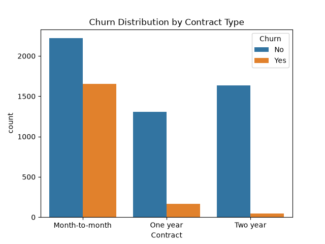
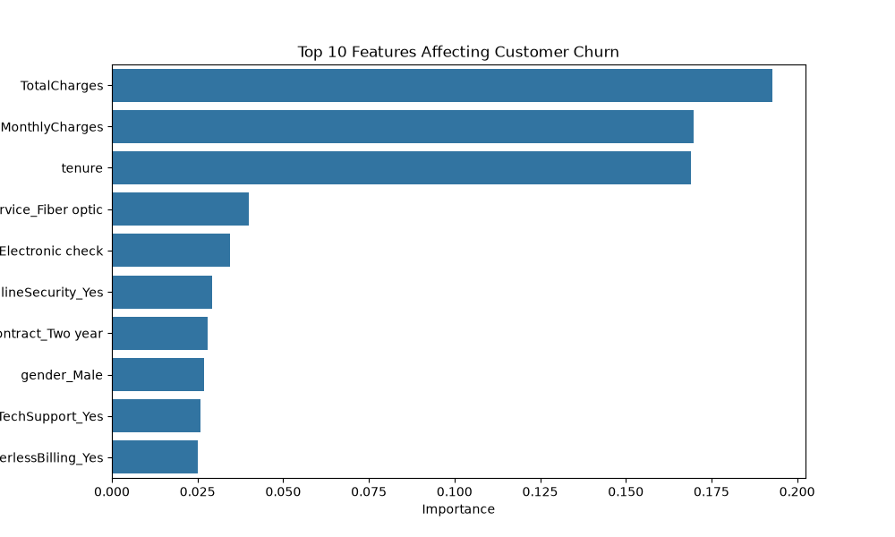

# Customer Churn Prediction

**Jinran Cheng** · Python data science portfolio

Identify patterns associated with telecom customer churn and compare two classification baselines.

**Skills demonstrated:** Classification · categorical encoding · training-only scaling · feature interpretation

## Results and interpretation

| Model | Accuracy | Precision | Recall | F1 |
|---|---:|---:|---:|---:|
| Logistic Regression | 0.787 | 0.621 | 0.516 | 0.564 |
| Random Forest | 0.785 | 0.629 | 0.463 | 0.533 |

Precision, recall and F1 refer to the churn class. Logistic Regression achieved higher recall and F1 in the saved run. Short tenure and month-to-month contracts were associated with churn; these are associations rather than proven causes.

Metrics above are rounded from the original saved analysis; they are not newly benchmarked results.

## Explore the analysis

- [01 customer churn prediction](notebooks/01_customer_churn_prediction.ipynb)

The numbered notebooks document the workflow, from data exploration to modeling. Saved outputs let you review the analysis directly on GitHub.

## Selected visualizations





## Run locally

1. Clone this repository and open its folder.
2. Create an environment and install dependencies:

```bash
python -m venv .venv
source .venv/bin/activate  # Windows: .venv\Scripts\activate
python -m pip install -r requirements.txt
mkdir -p data/raw
python -m jupyter lab
```

3. Obtain the data described below and place it in `data/raw/`.
4. Open the notebooks from their notebook folder and run cells from top to bottom. Relative data paths assume that working directory. For projects with multiple notebooks, follow their numeric order; each loads its own source data.

### Dataset

Kaggle Telco Customer Churn by BlastChar. Save the dataset as telco_customer_churn.csv in data/raw/.

Raw datasets are not redistributed here. Use the original provider's terms and permissions. Results may vary with dataset versions and package versions. Dependencies list the directly used libraries; a fully locked environment has not been validated.

## Limitations and next steps

The baseline misses a substantial share of customers who churn. Threshold tuning, stratified validation and cost-sensitive evaluation would be useful next steps before operational use. The confusion-matrix image corresponds to Random Forest.

## Project structure

- `README.md`: project overview, results and setup
- `requirements.txt`: direct Python dependencies
- `notebooks/`: documented analysis and saved outputs
- `images/`: selected plots
- `data/raw/`: local source datasets (excluded from Git)
